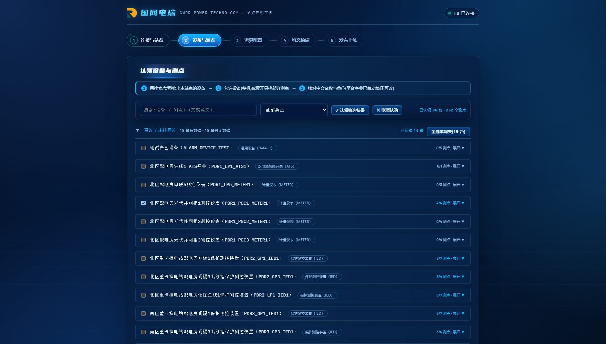
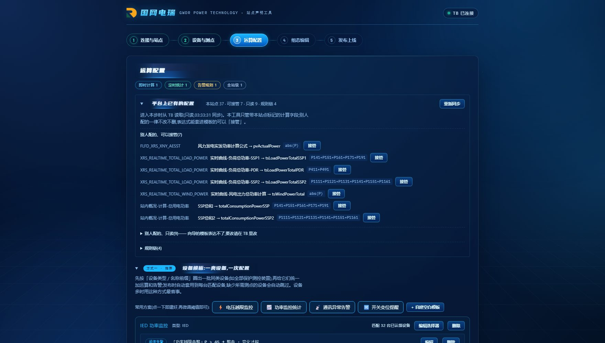
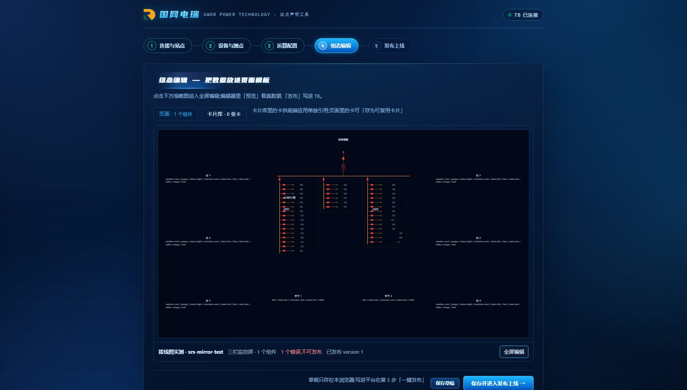
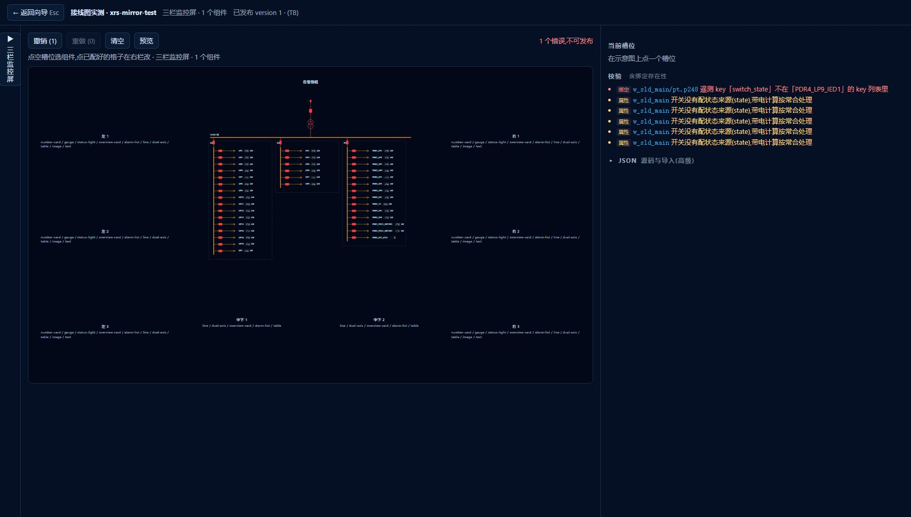
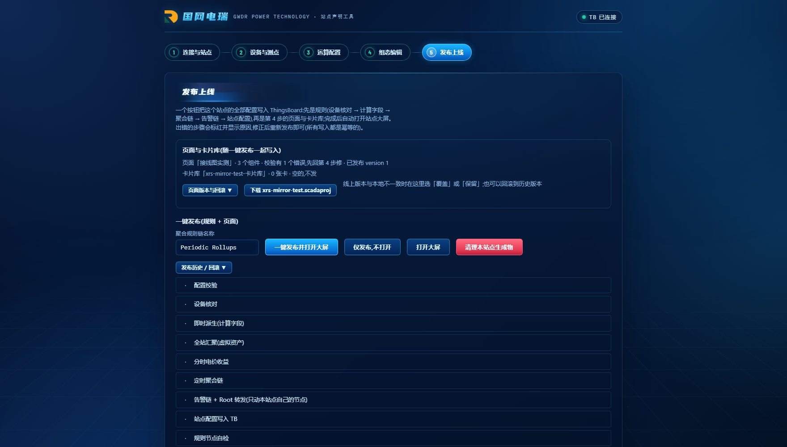
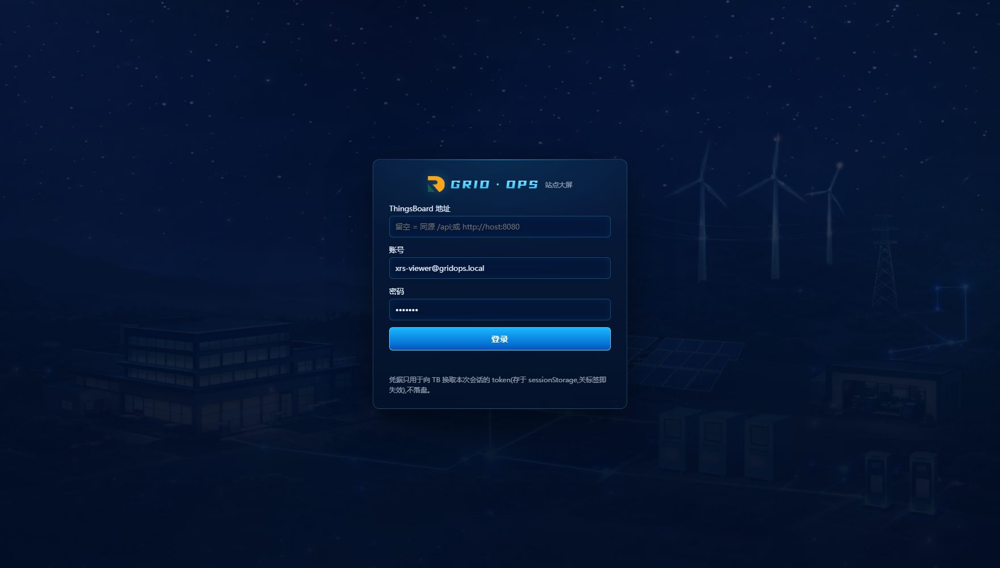
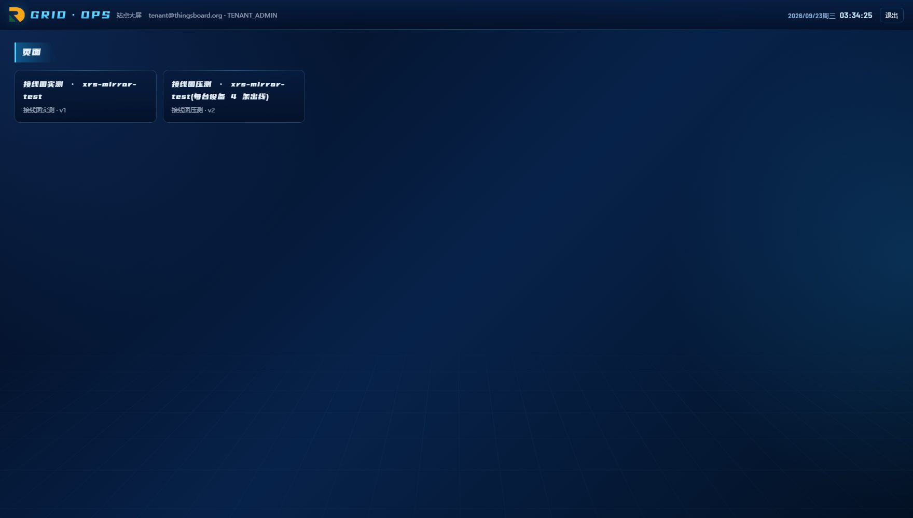
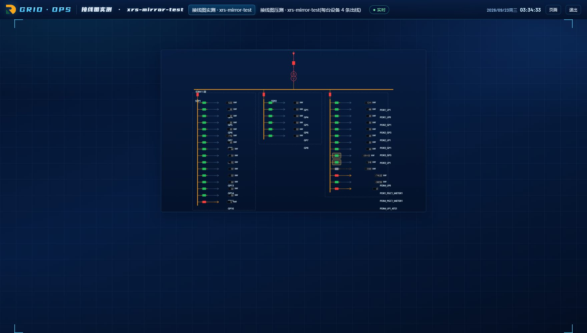

# 站点声明工具 · 操作说明(给现场工程人员)

> 这份说明只讲怎么用。打开浏览器,五步走完,站点的监控页面就上线了;以后改配置再走一遍就行,不需要找开发。
> 你需要:管理员给的 **ThingsBoard 管理账号**(向导用)、**客户账号**(查看大屏用)、工具地址(如 `http://主机/provisioner.html`)。推荐 Chrome / Edge,屏幕宽度 1440 以上。
> 截图来自 2026-09-07 的镜像环境(站点「仙人山服务区」),你的界面数据不同,位置一样。

---

## 0. 五步是什么

| 步 | 做什么 | 结果 |
|---|---|---|
| 1 连接与站点 | 填平台地址、账号,给站点起名 | 工具自动发现平台上的设备与测点;已有站点会把上次的配置和页面读回来 |
| 2 设备与测点 | 勾选这个站点要管的设备和测点 | 站点的「设备清单」 |
| 3 运算配置 | 选要算什么(总功率、阈值告警、多级归档) | 站点的「规则」 |
| 4 组态编辑 | 选页面模板,往格子里放组件,点选数据 | 站点的「页面」 |
| 5 发布上线 | 一键写进平台 | 大屏刷新即见;可回滚 |

顶部的 1–5 圆点可以随时来回点,不会丢东西;第 2、3 步右下有「保存草稿」,草稿只存在你这台电脑的浏览器里。

---

## 1. 连接与站点

1. **目标环境**:下拉选平台。没有你要的就点「＋ 新项目」,填平台地址(形如 `http://192.168.x.x:8080`)。
2. **账号 / 密码**:管理员给的管理账号。「记住账号」只会把账号名保存在这台电脑的浏览器里 30 天,密码每次都要输。
3. **站点标识**:英文短名,如 `xrs-mirror-test`,以后大屏地址里就用它;**站点名称**是给人看的中文名。
4. 点「**连接并发现设备**」。成功后右上角显示「TB 已连接」,下方列出平台上的设备数。

如果这个站点标识以前发布过,工具会自动读回上次的设备、规则和页面——你看到的就是当前线上的样子,改完再发布即覆盖。

---

## 2. 设备与测点

- 左上筛选框:按**类型**(如 IED、METER)或**名称开头**(如 `SSP1_`)过滤。
- 「**一键认领筛选结果**」:把筛出来的设备连同全部测点一次勾上;「✕ 取消认领」反向操作。
- 想精细一点:展开某台设备,只勾需要的测点,可以给测点改中文名和单位(页面上显示用)。
- 右下「**保存并进入运算配置 →**」。

> 认领的意思是「这个站点要管它」。没认领的设备不会出现在后面的运算和页面里,也不会被工具改动。

---

## 3. 运算配置

两种方式,可以混用:

- **设备模板**(推荐):按设备类型批量配。例如「IED 功率监控」= 对所有 IED 类型设备:`P > 45 kW` 报一条告警 + 算一个 `P+Q`。新增的设备只要类型对,自动套用。
- **单项运算**:对具体设备或整站配一条,如「全站总有功功率 = 所有 IED 的 P 求和」。

填输出名时只填英文名(如 `totalP`),工具会自动加前缀 `calc_`,平台上看到的是 `calc_totalP`,一眼能认出是工具算出来的。

配好点「**保存并进入展示配置 →**」。这一步只是写下规则,还没有写进平台,第 5 步才生效。

---

## 4. 组态编辑(配页面)

进来先看到页面缩略图和一行状态(标题、模板、组件数、校验结果、已发布版本)。**点缩略图或右侧「全屏编辑」进入编辑**;编辑完按 Esc 或左上「← 返回向导」回来。

全屏里三栏:

- **左栏**:页面标题;三个模板(态势总览台 9 格、三栏监控屏 10 格、3×3 栅格)点一下就切换;下方「项目文件」可以导出 / 导入整份配置。
- **中间**:页面示意图。**点一个格子** → 弹出可放的组件(数字卡、仪表盘、状态灯、曲线、双轴、概览卡、告警列表、表格、图片、文本),选一个。工具栏有撤销 / 重做 / 清空 / 预览 / 发布。
- **右栏**:当前格子的组件**属性**(标题、单位、小数位、颜色……改了立刻反映到示意图)和**绑定**(这个组件的数据从哪来)。绑定时先在设备树里点设备或资产,再从它的测点列表里点测点,**不用手打任何名字**。曲线可以放多条,但**一条绑定只画一条曲线** —— 要画三条就添三条绑定。

  超过 3 天的长曲线(平台上只留 3–7 天原始数据)把来源选成「**外部(kz)**」,再选一种查询:

  - **归档历史**:和普通曲线一样点设备 / 资产、点测点,另外选窗口(30 天、90 天……)、粒度(按小时 / 按天 / 按月)和聚合方式(平均 / 最大 / 最小)。
  - **收益趋势**:点**站点**(站点在设备树里就是那台**网关**设备),再选要画哪条 —— 放电收益 / 充电成本 / 净收益 —— 和周期(本月逐日 / 本年逐月)。

  两种都不用手写参数。行末的「高级:直接改 params JSON」平时不用管,是给排查问题时看的。

右栏底部的「校验」会实时告诉你缺什么(如「必填槽位为空」「测点不存在」);全部通过才能发布。「预览」用真数据渲染整页,可以切到客户账号视角看客户能看到什么。

> 注意「N 个绑定在当前账号下不可见」:说明这些设备 / 资产没有分配给这个客户,客户登录大屏会看到「不可用」。找管理员把实体分配给该客户,或换绑别的数据。

---

## 5. 发布上线

上半部分是**页面**:「发布页面」把第 4 步的页面写进平台;「预览页面」再看一眼;「下载 .scadaproj」把整份配置存成文件(存档、换环境重放都用它)。

下半部分是**规则**:「**发布并打开大屏**」把第 2、3 步的设备与运算写进平台并跳到大屏;「仅发布」不跳转。每一步会显示进度,全部打勾即成功。

- **发布历史**:最近 10 版,选一版「载入此版本」再发布就是回滚。
- **发布失败 N 项**:其余项已成功,看失败清单修好后点「重试失败项」,不会重复写。
- 「清理」按钮会删掉这个站点在平台上的全部规则,只有管理员角色可见,不要随手点。

---

## 6. 看大屏

大屏地址:`http://主机/site.html?site=站点标识`。打开先登录,用**客户账号**(客户账号只看得到分给它的页面和设备,这就是最终用户看到的样子;管理账号能看到全部)。

登录后列出这个站点的页面,点一张进入;顶部可以在多张页面之间切换,右上角有「页面」返回列表和「退出」。

顶栏绿点「实时」表示和平台连着;断网会变成「离线」,恢复后自动续上,不用刷新。组件显示「不可用」说明这个账号没有权限看它绑定的设备(见第 4 步注意)。

---

## 7. 常见报错与处理

| 看到什么 | 意思 | 怎么办 |
|---|---|---|
| 第 1 步「连接失败:HTTP 401」 | 账号或密码错 | 重新输入;账号是不是被禁用,问管理员 |
| 「连接失败:Failed to fetch / 网络错误」 | 浏览器连不上平台地址 | 检查地址、端口、VPN / 内网;用同一台电脑浏览器直接打开平台地址试试 |
| 第 2 步「尚未发现设备」 | 没连上,或平台上这个账号看不到设备 | 回第 1 步重新连接 |
| 第 4 步右栏红色条目 | 页面配置有错,发布按钮灰掉 | 点条目会跳到出错的格子;通常是必填格子没放组件、组件没绑数据、测点名不存在 |
| 「N 个绑定在当前账号下不可见」 | 预览用的客户账号看不到这些设备 / 资产 | 让管理员把它们分配给该客户;或换绑 |
| 发布时弹「线上版本与本地不一致」 | 别人在平台上改过这个页面 | 「覆盖」以你手里的为准;「保留」把线上的读回来再改;「取消」先不发 |
| 发布「Calculated fields per entity limit reached」 | 这台设备上的运算太多(平台上限 5 个) | 删掉不用的运算,或把运算放到别的设备 / 资产上 |
| 发布「设备 xxx 在 TB 中不存在」 | 设备被改名或删除 | 回第 2 步重新认领(工具按名字找设备) |
| 大屏曲线显示「kz 未配置」 | 超过 3 天的长曲线要从归档服务取,而大屏地址没告诉它归档服务在哪 | 与平台同域部署时自动可用;单文件部署要在地址上加 `&kz=http://平台主机:8099`,问运维 |
| 大屏「登录已过期,请重新登录」 | 平台的登录凭证到期(通常几小时) | 重新登录即可 |
| 大屏顶栏「离线」超过 1 分钟 | 平台或网络断了 | 看平台是否在线;恢复后大屏自动续传 |

---

## 8. 几个约定

- 站点标识、输出名用英文;中文放在名称、标题、单位里。
- 工具算出来的量都带 `calc_` 前缀,平台里看到这个前缀就知道是工具写的,删站点时也只删这些。
- 改配置的顺序永远是:在工具里改 → 发布。**不要直接在平台后台改工具生成的东西**,下次发布会被覆盖。
- 配置文件(第 5 步下载的 `.scadaproj`)建议每次发布后存一份,换平台、恢复现场都靠它。
