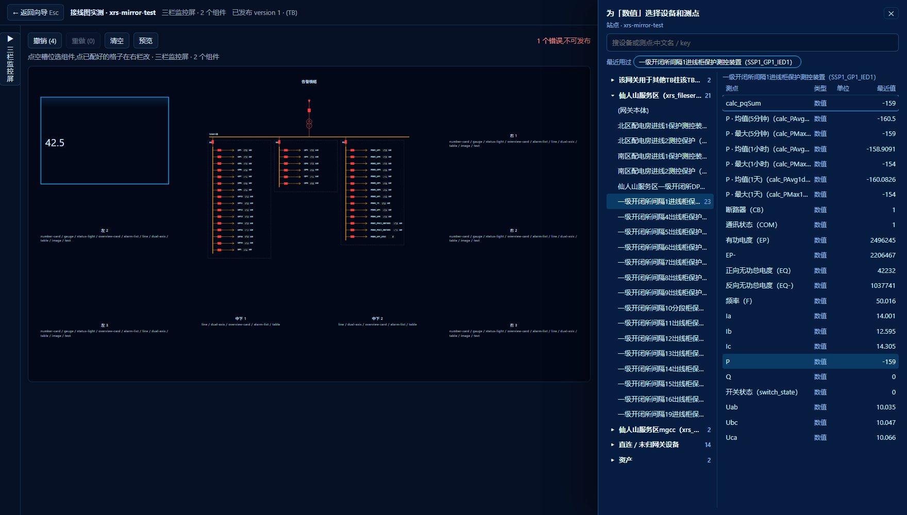
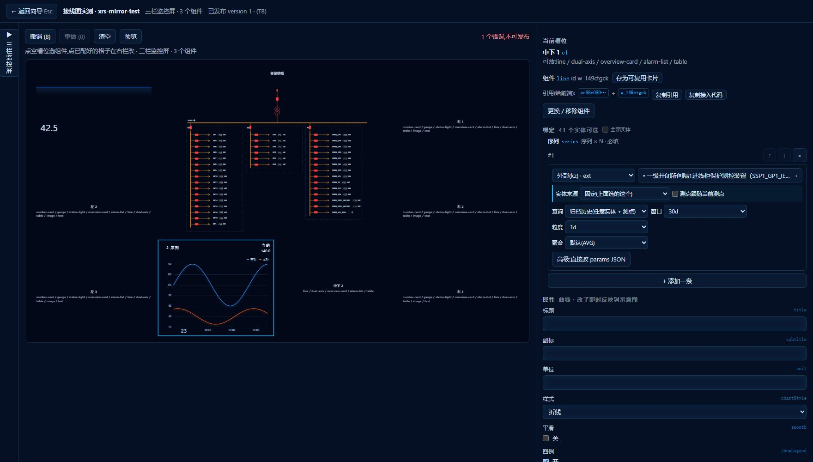

# 站点声明工具 · 操作说明(给现场工程人员)

> 这份说明只讲怎么用。打开浏览器,五步走完,站点的监控页面就上线了;以后改配置再走一遍就行,不需要找开发。
> 你需要:管理员给的 **ThingsBoard 管理账号**(向导用)、**客户账号**(查看大屏用)、工具地址(如 `http://主机/provisioner.html`)。推荐 Chrome / Edge,屏幕宽度 1440 以上。
> 截图来自 2026-09-07 的镜像环境(站点「仙人山服务区」),你的界面数据不同,位置一样。

---

## 0. 五步是什么

| 步 | 做什么 | 结果 |
|---|---|---|
| 1 连接与站点 | 填平台地址、账号,给站点起名 | 工具自动发现平台上的设备与测点;已有站点会把上次的配置和页面读回来 |
| 2 设备与测点 | 勾选这个站点要管的设备和测点 | 站点的「设备清单」 |
| 3 运算配置 | 选要算什么(总功率、阈值告警、多级归档) | 站点的「规则」 |
| 4 组态编辑 | 选页面模板,往格子里放组件,点选数据 | 站点的「页面」(和给前端用的「卡片库」) |
| 5 发布上线 | **一个按钮**把规则和页面全部写进平台 | 大屏刷新即见;可回滚 |

顶部的 1–5 圆点可以随时来回点,不会丢东西;第 2、3、4 步右下有「保存草稿」,草稿只存在你这台电脑的浏览器里。**写进平台的动作只有第 5 步那一个按钮**,前四步怎么改都不会碰平台(第 3 步「保存并进入」会顺手建几个结果资产,那是运算要用的容器,不影响线上)。

---

## 1. 连接与站点

1. **目标环境**:下拉选平台。没有你要的就点「＋ 新项目」,填平台地址(形如 `http://192.168.x.x:8080`)。
   选中的环境可以「重命名」(自己录的项目按钮叫「编辑」,还能改地址)或「删除」——删除会一并清掉这台电脑为它存的登录与草稿,**不能恢复**;至少要留一个环境。
2. **账号 / 密码**:管理员给的管理账号。「记住账号」只会把账号名保存在这台电脑的浏览器里 30 天,密码每次都要输。
3. **站点标识**:英文短名(字母、数字、- 和 _),如 `xrs-mirror-test`,以后大屏地址里就用它。**发布后不要改**——改了会被当成新站点,旧站点的规则链、资产还留在平台上,大屏地址也会变。
4. 点「**连接并发现设备**」。成功后右上角显示「TB 已连接」,下方列出平台上的设备数。
5. **分配给客户**(管理员账号才有):连接后在下方选这个站点分给哪个客户,点「分配」。客户账号(大屏值班用的)只看得到分给它所属客户的站点和页面;工具建的页面、结果资产会一起分过去。页面上用到的设备如果不在该客户下,这里会列出来——设备要在 TB 里单独分(可能是同事在用的,工具不动)。新站点还没发布的,选好点「分配」,第 5 步发布时自动分。

如果这个站点标识以前发布过,工具会自动读回上次的设备、规则和页面——你看到的就是当前线上的样子,改完再发布即覆盖。

---

## 2. 设备与测点

- 左上筛选框:按**类型**(如 IED、METER)或**名称开头**(如 `SSP1_`)过滤。
- 「**一键认领筛选结果**」:把筛出来的设备连同全部测点一次勾上;「✕ 取消认领」反向操作。
- 想精细一点:展开某台设备,只勾需要的测点,可以给测点改中文名和单位(页面上显示用)。
- 右下「**保存并进入运算配置 →**」。

> 认领的意思是「这个站点要管它」。没认领的设备不会出现在后面的运算和页面里,也不会被工具改动。

---

## 3. 运算配置

两种方式,可以混用:

- **设备模板**(推荐):按设备类型批量配。例如「IED 功率监控」= 对所有 IED 类型设备:`P > 45 kW` 报一条告警 + 算一个 `P+Q`。新增的设备只要类型对,自动套用。
- **单项运算**:对具体设备或整站配一条,如「全站总有功功率 = 所有 IED 的 P 求和」。

填输出名时只填英文名(如 `totalP`),工具会自动加前缀 `calc_`,平台上看到的是 `calc_totalP`,一眼能认出是工具算出来的。

配好点「**保存并进入展示配置 →**」。这一步只是写下规则,还没有写进平台,第 5 步才生效。

---

## 4. 组态编辑(配页面)

进来先看到页面缩略图和一行状态(标题、模板、组件数、校验结果、已发布版本)。**点缩略图或右侧「全屏编辑」进入编辑**;编辑完按 Esc 或左上「← 返回向导」回来。

全屏里三栏:

- **左栏**:页面标题、**大屏抬头**(见下);三个模板(态势总览台 9 格、三栏监控屏 10 格、3×3 栅格)点一下就切换——**换模板不丢组件**:槽位名对得上的原位不动,对不上的(比如三栏监控屏「主视区」里的接线图)自动挪到新模板里空着又放得下的格子,实在放不下的先收起来、换回放得下的模板会自动放回(也可以撤销);下方「项目文件」可以导出 / 导入整份配置。选好模板后左栏会自动**收起**成一条竖条,把宽度让给右栏的属性和绑定(下拉框更宽、不再挤到下面);点竖条随时展开,左栏右上角「◀ 收起」再收。页面里已经有组件时进全屏默认就是收起的。
- **中间**:页面示意图。**点空格子** → 弹出可放的组件(数字卡、仪表盘、状态灯、曲线、双轴、概览卡、告警列表、表格、图片、文本),选一个;**点已经配好的格子**不再弹窗,直接在右栏改它的绑定与属性,要换 / 删组件点右栏的「更换 / 移除组件」。工具栏有撤销 / 重做 / 清空 / 预览 / 发布。
- **右栏**:当前格子的组件**绑定**(这个组件的数据从哪来,放在最上面)和**属性**(标题、单位、小数位、颜色……改了立刻反映到示意图)。绑定时先在设备树里点设备或资产,再从它的测点列表里点测点,**不用手打任何名字**。设备树默认只列**这个站点的东西**:第 2 步认领的设备(所属网关一起)、第 3 步运算会写到的设备和资产、站点资产;要绑别的,勾上「绑定」标题右边的「全部实体」就是平台全库。设备和测点都显示「中文(英文)」:设备的中文来自平台上的设备标签,测点的中文来自平台字典;**第 2 步给测点改过的中文名在这里优先显示**。没有中文的(如网关、资产)只显示英文——想要中文,在平台上给它填标签。曲线可以放多条,但**一条绑定只画一条曲线** —— 要画三条就添三条绑定。

  超过 3 天的长曲线(平台上只留 3–7 天原始数据)把来源选成「**外部(kz)**」,再选一种查询:

  - **归档历史**:和普通曲线一样点设备 / 资产、点测点,另外选窗口(30 天、90 天……)、粒度(按小时 / 按天 / 按月)和聚合方式(平均 / 最大 / 最小)。
  - **收益趋势**:点**站点**(站点在设备树里就是那台**网关**设备),再选要画哪条 —— 放电收益 / 充电成本 / 净收益 —— 和周期(本月逐日 / 本年逐月)。

  两种都不用手写参数。行末的「高级:直接改 params JSON」平时不用管,是给排查问题时看的。

### 一次接线图 · 2026-09-20 新增的四样

- **在线 / 离线状态灯**(绿点呼吸 = 在线,红点常亮 = 离线,灰点 = 没数据)
  - **各个设备**:从设备树把设备拖进画布,灯**自动就有、自动绑好**。已经画好的图:选中节点 →「绑定」页签勾上「在线状态灯」;
    一次要加很多台,就框选它们,「绑定」页签里点「给选中的 N 台设备加在线状态灯」。灯默认在图元右上角,可改到别的角。
  - **整个站点**:工具栏「加在线状态标签」(快捷键 O)→ 在图上点一下 →「绑定」页签里选**网关设备**的 `active`
    (站点在设备树里就是那台网关)。标签上的字(默认「站点」)、字号、颜色在「属性」页签改。
- **文字**:选中文字 →「属性」页签里改**字号、加粗、颜色**(随主题 / A 黄 / B 绿 / C 红 / 自定义)。数值标签、状态标签同理。
- **母线**:选中母线 →「属性」页签里改**粗细**(2–16)和**颜色**。自己设了颜色就不再按电压等级上色,但**失电时照样变灰**。
- **图元大小**:选中图元,**直接拖它四角(或四边)的小方块**就能放大缩小,宽高比是锁住的;拖哪个角,对面那个角就不动。
  拖的过程是连续的,**松手时会吸附到最近的一档**(0.5、1、1.5、2 … 最大 6 倍)——因为端口必须落在栅格上连线才对得齐,
  所以不同图元能停的档位不完全一样,吸附一下是正常的。要精确倍数,也可以在「属性」页签的「大小」下拉里选
  (那里是以图元中心为准放大的,一路出线上的开关、电表放大后还在同一条竖线上)。
- **拖拉改大小时连线跟着走**:拖图元四角的小方块,端口和接在上面的连线会实时跟着动,松手再吸附到最近一档。
- **重叠时谁压着谁(叠放层次)**:选中图元或母线 → 工具栏「**置顶**」「**置底**」(快捷键 `]` 和 `[`),或「属性」页签「层次」一行里点。
  默认是图元压着连线、连线压着母线;把一个图元「置底」它就垫到母线底下,把一条母线「置顶」它就浮到图元上面;
  两个图元叠在一起,想让哪个在上就把哪个「置顶」。「复位」回到默认。大屏上看到的和这里排的一样。
- **横竖母线接在一起**:把竖母线的头**顶到横母线上**(T 形)或两条**端头对端头**(L 形)就算连通了——
  拐角不再缺口,带电着色也会跟着传过去,**不用再补一根连线**。两条母线十字交叉、谁的头都没碰到对方,则不算连通。

### 一次接线图 · 2026-09-22 新增的六样(按现场走查意见)

- **一次改一批(母线 / 文字 / 图元的颜色、粗细、字号)**:框选(或按住 Ctrl 点)多个元素,右栏「属性」按**类型分块**列出来——
  「母线 · 3 个」「文字 · 5 个」各自一块。在哪一块里改颜色 / 粗细 / 字号 / 大小,就对**那一类的全部选中项**生效,
  一次算撤销栈里的一步。不同类的混选也行,各改各的。只选中一个时,还会多出 id、名称、位置这些单体信息。
- **设备框可以随便拉长宽**:设备框(以及以后别的矩形类图元)不再只能按倍数等比放大——
  直接拖四角 / 四边的手柄,横竖分开拉;或者在「属性」里直接填**宽**和**高**。
  宽高会吸附到 2 格一步(端口必须落栅格,连线才对得齐)。**线宽不会被拉扁**:框是按你要的宽高重画的,不是把小框拉大。
  注意:选了「大小 N 倍」就会清掉自由宽高,两者只能用一个。
- **图元颜色**:选中图元 →「属性」里的**颜色**。自定义色盖过电压等级色;失电时颜色还在,只是变暗
  (设备框、互感器这些器件本来就不在带电回路里,真按失电抹成灰就等于不让改)。母线仍是老规矩——失电变灰。
- **分组框边框**:选中分组框 →「属性」里改**边框颜色、粗细(1–8)、实线 / 虚线**。
- **数值对齐**:一个设备框里放一列数值(「Uab 388.7 V」「P 0.4 kW」…),前缀长短不一时数字起点对不齐。
  现在框选这一组数值标签 →「属性」→「数值列」旁边点「**对齐**」,自动算出一个列宽,让**数字右对齐成一列、单位也对齐**;
  也可以直接填列宽数字微调,填 0 回到原来的样子。
- **开关没数据时按合闸画**:回路只有电流、没有位置信号时,状态测点一直没值,开关就一直是虚线的「未知」,
  带电色也传不下去、整段是灰的。选中这些开关 →「属性」→「**没数据时**」选「按合闸画」(可以框选一批一起设)。
  **有数据时仍以数据为准**。另外编辑器画布上的开关现在按合闸画(以前一律画成分位,看着像整站都跳闸了)。
- **右栏可以拖宽**:右栏左边沿按住拖就能改宽度,双击恢复默认。宽度记在本机浏览器里。

### 跟随页面上下文(设备测试页、历史数据页这类「选了哪台看哪台」的卡)· 2026-09-21

平时一张卡绑的是**固定**的某台设备。有些页面不一样:前端页面上有一棵设备树 / 一个测点下拉 / 一个时间选择器,
用户选了哪台,卡片就该显示哪台——这种卡在绑定里选「跟随页面上下文」,**一张卡配一次,所有设备通用**。

- 右栏绑定那一行,选好模式后下面多了一条浅蓝色的「**实体来源**」:
  - 「固定」= 老样子;「**跟随当前设备 / 当前站点**」= 运行时由前端页面告诉它是哪台。很少用到的业务对象选「跟随自定义键」,填 `custom.` 后面的名字(和前端同事约定好)。
  - 选了跟随之后,上面选的那台设备就变成了「**样例:**xxx」——只用来在这里**挑测点、看预览**,不会出现在正式页面上。
  - 「**测点跟随当前测点**」:勾上后测点也由前端页面决定(历史数据页的测点下拉);这里选的测点同样只是样例。
  - 曲线的「窗口」下拉最上面多了「**跟随时间范围**」:前端页面的时间选择器说了算,可以是「最近 24 小时」,也可以是起止日期。
  - 「**没选时**」:用户还没选设备时这张卡怎么办——显示「未选择设备」(缺省)、整张卡不显示、显示错误,或者「用样例值」
    (只有这一项会让样例设备真的出现在正式页面上,适合「默认先看 1# PCS」的页面)。
- **预览**:页面里有这种卡时,预览顶上会多一条「**上下文模拟**」——在这里扮演前端页面:换一台设备、填一个测点、改时间范围
  (「起止时间…」可以选具体日期),看卡片跟着换;选「(不选)」看没选时的样子。它只影响这次预览,不写进页面。
- **发布**:校验里会多一条黄色提示「本页有绑定跟随页面上下文…」,提醒两件事:前端那边的渲染器要 **0.9.0 以上**;
  独立大屏(第 6 步的 `site.html`)里**没有人提供上下文**,这种卡在大屏上只会按「没选时」的设置显示——它们是给前端页面嵌卡用的,不是给大屏用的。
- 卡片库「检视」页里,每张这样的卡会标出「**需要上下文**:selectedDevice…」,「复制接入代码」里也带着,发给前端同事就知道要喂什么。
- 一次接线图里的测点不支持跟随(图上的设备是画死的)。

### 大屏抬头(页面最上面那条标题带)

左栏「大屏抬头」这一组,填什么大屏上就显示什么 —— 边填边在中间的示意图里看到效果:

| 填的 | 显示在哪 | 例子 |
|---|---|---|
| **主标题** | 正中间,大字 | 仙人山服务区智能微电网监控系统 |
| **副标题** | 主标题下面一行小字,可空 | XIANRENSHAN MICROGRID MONITORING |
| **单位名称** | 左上角,可空 | 国网电瑞 · 仙人山二期 |
| **图标** | 左上角,单位名前面 | 点「选图片」从本机选,png / jpg / svg 都行,**不超过 200 KB** |
| **标题位置** | 居中(默认)或靠左紧跟图标 | |

- **主标题留空 = 不显示抬头**,整页和以前一样。想暂时不显示又不想删掉填好的字,把标题右边的「显示」勾掉。
- 抬头跟着页面一起发布,**大屏、前端应用、预览看到的是同一份**,不用在别处再配一遍。
- 图标是存进页面里的(现场没有图床),所以有 200 KB 的限制;超了会提示你换小图。
- 抬头会占掉页面顶部一条,**下面的内容会相应缩小一点**,这是正常的。

上图是点开测点下拉的样子。**最上面一组「⭐ 本站配置的运算结果」是你在第 3 步配出来的**,
默认展开、排在最前;后面折着的「遥测」才是设备原本上报的量。第 3 步刚配好、**还没发布**的
结果会带一个「待发布」标记 —— **照样可以选**,第 5 步一起发布就行,不用先发一次再回来绑。

上图是「外部(kz)」的样子:选完查询类型,剩下的实体、测点、窗口、粒度、聚合全是下拉,
和普通曲线一样点选。

右栏底部的「校验」会实时告诉你缺什么(如「组件没绑数据」「测点不存在」);全部通过才能发布。新页面一个组件都没放时显示「校验通过」,格子不是必填的,想放几个放几个。「预览」用真数据渲染整页,可以切到客户账号视角看客户能看到什么。

**一次接线图**:点格子选「一次接线图」(在「图形」一组;三栏监控屏的中间大格、态势总览台的四个图表格、3×3 栅格都能放)。右栏会显示「测点绑定 N 条,在接线图编辑器里维护」,点「**编辑接线图…**」进全屏的接线图编辑器:

- **忘了快捷键**:工具栏右边「**? 按键说明**」(或按 **F1**)列出全部快捷键与鼠标操作,Esc 关。
- **画**:左边是图元(断路器、手车、隔离 / 接地刀、简化开关、互感器、主变、电源、光伏、储能、负荷……),拖到画布上;工具栏「画母线」按住拖出一条横 / 竖母线;从图元的端口(小圆点)拖到另一个端口或母线上任意位置就是一根线,线会自动走成横平竖直,点线出现拐点手柄可以调。R 旋转、F 镜像、方向键微移、Ctrl+Z / Y 撤销重做、Ctrl+C / V 复制。「加分组框」画虚线框(一面柜 / 一个系统),「加文字」写说明。
- **绑**:右边「绑定」页签。选中一个图元 → 选它对应的**设备**;开关类再选「开关状态」测点并核对「值 → 合 / 分」(默认 1 合 0 分,反了点「取反」);「+ 添加数值标签」挑测点、写前缀(如 P、Ia)、单位、小数位,三相量可以选 A / B / C 相色(黄 / 绿 / 红),状态量可以填枚举文字(如 0 停止、1 运行)。更快的办法:展开「设备树」,选一台设备**拖到画布上**,工具会按设备名自动选图元、自动挂上开关状态和常用测点(P / Q / 三相电流电压 / SOC……)。
- **省事的**:画好一个出线间隔(开关 + 标签)后框选它,**Ctrl+D「复制间隔」**填份数,工具按设备名规律改名改绑(如 LP1 → LP2、LP3……),预览表里先看一眼再确认;「对齐 ▾」做对齐和等距;「底图」可以导入现有一次图的图片当描摹底图(只在编辑时显示,**不会发布**)。
- **查**:右边「问题」页签列出没绑的测点、悬空的线、多余的绑定,点一条定位到图上;「清理多余绑定」一键删掉没人用的。
- **电源点与电压等级**:图要能「带电着色」,至少要有一个电源(进线 / 电网电源 / 光伏 / 电池拖进来默认就是电源;别的图元在「属性」页签勾「电源点」)。颜色按电压等级取:在「属性」里给电源点、母线填「电压 kV」,给主变填两侧的 kV(如 hv 10、lv 0.4);不填也能着色,只是统一用主题色。运行时从电源沿合位开关传出去,带电的按电压等级上色(10 kV 红、0.4 kV 橙……),失电的变灰,开关状态拿不到的画成虚线(「不确定」),数据超过 10 分钟没更新的数值变灰。
- **边画边存**:停手 2 秒自动保存到页面,也可以点右上角「**保存**」或按 **Ctrl+S**;顶上会显示「已保存到页面 时:分:秒」。
  画完点「**完成**」关闭(页面编辑器里撤销一步就能把这次打开以来的改动整体退回);「放弃修改」会先确认,中途保存过的也一并退回。
  注意这里的「保存」是存进**这张页面**;页面本身要留到下次打开浏览器,还得在第 4 步底部点「保存草稿」,要上大屏则是第 5 步发布。

大屏上接线图可以滚轮缩放、拖动平移、双击复位;图比较大时用组件右上角「⤢ 放大」铺满全屏看。

**卡片库**(第 4 步顶部的第二个标签):给前端应用单独用的卡。前端同事的页面可以把这里的任何一张卡(数字卡、曲线、告警列表……)按「页面 id + 组件 id」嵌进他们自己的页面,不用整页大屏。

- 卡片库标签是一张**列表**,一行一张卡,两栏:左栏是组件(类型、标题、绑定数,「编辑」进编辑器改它,「删除」),右栏是**前端怎么引用它**(页面 id + 组件 id,「复制引用」「复制接入代码」)。卡片库没有「页面布局」的概念:「＋ 新建卡片」或「编辑」进去后,上面一排是所有卡片的标签,中间只画当前这一张,右栏改它的绑定和属性,配法和配页面里的一个组件一样。它不会出现在大屏的页面列表里。
- **预览卡片库(实时值)**:列表右上角这个按钮用真数据把每张卡一张一张画出来——左栏是带实时值的卡,右栏是它的数据源摘要、订阅报错(比如没权限)和前端引用。配完先在这里核一遍数值和数据源对不对,再去第 5 步发布。
- 页面里已经配好的一张卡想给前端用:在页面编辑里选中它,右栏点「**存为可复用卡片**」,它会被复制进卡片库第一个空格;之后两边各改各的,互不影响。
- 反过来,配页面时点格子选组件,弹窗最上面一组「从卡片库放入」可以把卡片库里的卡整张复制进来。
- 第 5 步有单独的「发布卡片库」按钮;卡片库是空的就不用发。
- 发布后要把卡给前端同事:在编辑器里选中那张卡,右栏「引用(给前端)」一行点「**复制引用**」(或「复制接入代码」),粘给前端即可——里面是页面 id 和组件 id。页面没发布时这一行会提示「先发布」,因为页面 id 是发布时平台分配的。

配好后点右下「**保存并进入发布上线 →**」:和第 2、3 步一样只存草稿(页面和卡片库一起存),不写平台;写平台在第 5 步。全屏编辑器工具栏里只有「预览」,没有「发布」——发布统一在第 5 步做。

> 注意「N 个绑定在当前账号下不可见」:说明这些设备 / 资产没有分配给这个客户,客户登录大屏会看到「不可用」。找管理员把实体分配给该客户,或换绑别的数据。

---

## 5. 发布上线

只有一个主按钮:「**一键发布并打开大屏**」。它先把第 2、3 步的设备与运算(规则)写进平台,再把第 4 步的页面和卡片库写进去,然后跳到大屏;「仅发布,不打开」一样但不跳转。每一步会显示进度,全部打勾即成功。上面「页面与卡片库」一栏是随发的内容摘要,不用单独点。

页面这半有两种情况会被拦下、不开大屏,栏里会写明原因:校验还有错(回第 4 步修);平台上的页面版本和你手里的不一致(有人在平台上改过,或你这份不是最新)——点「**页面版本与回滚 ▼**」,在面板里选「覆盖」(以你手里的为准重发)或「保留」(把线上的读回来再改)。想回到某个历史版本也在这个面板里:选一版「恢复为当前」。

- **发布历史**(规则):最近 10 版,选一版「载入此版本」再发布就是回滚。
- **发布失败 N 项**:其余项已成功,看失败清单修好后点「重试失败项」,不会重复写。
- 「下载 .scadaproj」把页面配置存成文件(存档、换环境重放都用它);「下载 .tbsite.json」是规则那份。
- **打开卡片库检视页**(卡片库发布后才亮):在大屏 `site.html` 里逐张检视卡片库——左栏实时值、右栏前端引用与数据源。前端同事也可以直接打开这个地址(`site.html?site=站点标识&cards=1`,登录后就是这一页)对着看。
- 「清理」按钮会删掉这个站点在平台上的全部规则,只有管理员角色可见,不要随手点。

---

## 6. 看大屏

大屏地址:`http://主机/site.html?site=站点标识`。打开先登录,用**客户账号**(客户账号只看得到分给它的页面和设备,这就是最终用户看到的样子;管理账号能看到全部)。

登录后列出这个站点的页面,点一张进入;顶部可以在多张页面之间切换,右上角有「页面」返回列表和「退出」。

顶栏绿点「实时」表示和平台连着;断网会变成「离线」,恢复后自动续上,不用刷新。组件显示「不可用」说明这个账号没有权限看它绑定的设备(见第 4 步注意)。

**放大一个组件**:鼠标移到任一组件上,右上角出现「⤢」,点一下这个组件就铺满整屏(数据照常实时刷新);右上角「✕」或按 Esc 回到整页,「浏览器全屏」可以再把浏览器也全屏。不用配置,每张页面的每个组件都有。

> **2026-09-20 起大屏换了一身皮**:登录页 / 页面列表 / 顶栏带企业 logo 与 GRID·OPS 字标,页面本身有深蓝渐变底、细网格与四角角标,卡片有渐变与高光,标题和数字用的是大屏字体。**这些都是自动的,不用配**——你照旧配页面就行。页面最上面那条写站名的抬头是**你在第 4 步填的**(填了才有);页面有抬头时,顶栏就不再重复写一遍页面名。上面三张截图是这次改版之前拍的,样子对不上属正常。

---

## 7. 常见报错与处理

| 看到什么 | 意思 | 怎么办 |
|---|---|---|
| 第 1 步「连接失败:HTTP 401」 | 账号或密码错 | 重新输入;账号是不是被禁用,问管理员 |
| 「连接失败:Failed to fetch / 网络错误」 | 浏览器连不上平台地址 | 检查地址、端口、VPN / 内网;用同一台电脑浏览器直接打开平台地址试试 |
| 第 2 步「尚未发现设备」 | 没连上,或平台上这个账号看不到设备 | 回第 1 步重新连接 |
| 第 4 步右栏红色条目 | 页面配置有错,发布会被拦下 | 点条目会跳到出错的格子;通常是组件没绑数据、测点名不存在 |
| 「N 个绑定在当前账号下不可见」 | 预览用的客户账号看不到这些设备 / 资产 | 让管理员把它们分配给该客户;或换绑 |
| 大屏「当前账号看不到任何页面」 | 站点没分给这个账号所属的客户,或站点还没发布页面 | 第 1 步「分配给客户」;第 4 / 5 步发布页面 |
| 发布时弹「线上版本与本地不一致」 | 别人在平台上改过这个页面 | 「覆盖」以你手里的为准;「保留」把线上的读回来再改;「取消」先不发 |
| 发布「Calculated fields per entity limit reached」 | 这台设备上的运算太多(平台上限 5 个) | 删掉不用的运算,或把运算放到别的设备 / 资产上 |
| 发布「设备 xxx 在 TB 中不存在」 | 设备被改名或删除 | 回第 2 步重新认领(工具按名字找设备) |
| 大屏曲线显示「kz 未配置」 | 超过 3 天的长曲线要从归档服务取,而大屏地址没告诉它归档服务在哪 | 与平台同域部署时自动可用;单文件部署要在地址上加 `&kz=http://平台主机:8099`,问运维 |
| 大屏「登录已过期,请重新登录」 | 平台的登录凭证到期(通常几小时) | 重新登录即可 |
| 大屏顶栏「离线」超过 1 分钟 | 平台或网络断了 | 看平台是否在线;恢复后大屏自动续传 |

---

## 8. 几个约定

- 站点标识、输出名用英文;中文放在名称、标题、单位里。
- 工具算出来的量都带 `calc_` 前缀,平台里看到这个前缀就知道是工具写的,删站点时也只删这些。
- 改配置的顺序永远是:在工具里改 → 发布。**不要直接在平台后台改工具生成的东西**,下次发布会被覆盖。
- 配置文件(第 5 步下载的 `.scadaproj`)建议每次发布后存一份,换平台、恢复现场都靠它。
