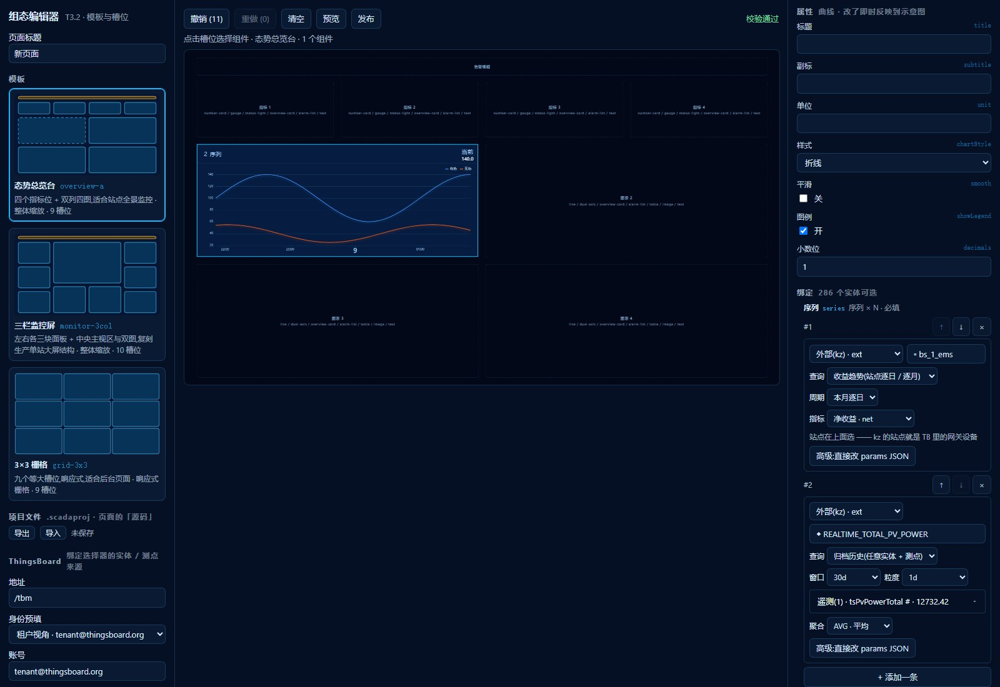

# ext(kz)绑定改成点选表单 · 2026-09-09

补的是外部审查(`codex-scada-deploy-tool-review-2026-09-08.md` §4.2)点出的那条缺口:
**「所有业务绑定均可树选且存在性已校验」对 `ext` 不成立**。提交 `db1b8ae`。

## 1. 原来是什么样

配 kz 外部数据源时,工程人员要在绑定行的一个 textarea 里手写 params JSON:

```json
{"entity":{"type":"ASSET","id":"95bf2370-527c-11f1-90ba-53cf2ab0fe96"},"keys":["tsPvPowerTotal"],"agg":"AVG"}
```

实体 id 得自己从别处抄一个 UUID 过来,测点名得自己拼对。校验层那边:

```ts
if (b.mode === 'const' || b.mode === 'ext') continue   // validate.ts,旧
```

——`ext` 整条跳过,写错什么都不报。要到发布之后打开页面看见空白,才知道有问题。

T4.1 的验收标准是「工程人员独立完成一页,开发者介入零次」。一个要手写 JSON、
写错还不报错的绑定,是这条标准下最像介入点的一处,所以先补它。

## 2. 现在是什么样

绑定行选「外部(kz)」后,先选**查询类型**(契约 §4.3b 冻结的两种),再按类型出表单:

| 查询类型 | 表单 | 产出 params |
|---|---|---|
| 归档历史(任意实体 + 测点) | 实体(元数据树)+ 测点(KeyPicker,与 `ts` 同一套分组、带最近值)+ 窗口 + 粒度 + 聚合 | `{ entity, keys, agg? }` |
| 收益趋势(站点逐日 / 逐月) | 站点(元数据树)+ 指标(放电收益 / 充电成本 / 净收益)+ 周期(本月逐日 / 本年逐月) | `{ stationId, metric }` |

params JSON 收进「高级:直接改 params JSON」,默认收起;只有当 params 两种形状
都不像(手写坏了、外部导入的旧配置)时才自动展开,当后路用。



**判定分支的写法和 tbClient 一字不差**:`Array.isArray(params.keys)` 优先,
其次看 `stationId`。编辑器和运行时对同一份 params 的理解必须一致,否则会出现
「编辑器认为是收益趋势、tbClient 走了通用查询」这种最难查的错。

## 3. kz 的 stationId 到底是什么(本次查清)

契约里 `stationId` 只写了「站点标识」,没说从哪来 —— 所以原来只能手抄。实测:

**`stationId` 就是 TB 里 `gateway` 类型设备的 id。** 镜像上 `84a690c0-7381-11f1-8007-51b9f7714bbe`
是设备 `bs_1_ems`(标签「基站储能项目1」,type `gateway`),正是 live 测试里那个
`revenueStationId`。逐个试镜像上的 5 台网关:

| 设备 | kz 收益趋势 |
|---|---|
| `bs_1_ems` / `bs_2_ems` | `code 200`,有数据 |
| `TEST_网关_状态` / `rydq_gz_ems` | `code 200`,0 行(是站点,没归档) |
| `xrs_fileserver` | `code 500 该站点下无设备` |
| 任意非网关设备、随便编的 UUID | `code 500 该站点下无设备`(同一句) |

所以站点可以从元数据树里点,不用手抄 UUID。同时也说明:**kz 对任何不是站点的 id
一律只回「该站点下无设备」这一句**,现场分不出「选错了」还是「这个站点真没归档」。
这一层只能由编辑器替它分 —— 见下面的校验。

## 4. 校验补了哪些

静态层(不连 TB 也跑,和审查 R3 的规则放在一起):

- 源不是 `kz` / 粒度不在 kz 的六个桶里 → error
- 归档历史:实体缺 `type`/`id`、`keys` 为空、聚合不在 `AVG/MAX/MIN/ZD` 里 → error
- 收益趋势:`stationId` 为空、指标不在 `inc/cost/net` 里 → error
- params 两种形状都不像 → error「kz 无法分派」
- 粒度选 `1y` → warning(kz 年桶只回单点,图上看不出东西)

第 ② 层存在性(需要 TB 连接):

- 归档历史的 `params.entity` 按 ADR-002 解析,`params.keys` 对 TB 的遥测 key 核对。
  key 不在 TB 列表里只给 **warning**:kz 是独立归档库,TB 侧已停更或已清理的点位
  仍可能有历史,拿 TB 的 latest key 当唯一真相会误杀。
- 收益趋势的 `stationId` 在树里找不到 / 找到但不是网关 → warning,直说 kz 会回什么。

另外一条和 R3 同源:**一条 ext 绑定也只画一条序列**。渲染器 `bindSeries` 取的是
`Object.values(r.series)[0]`,所以归档历史写多个 key 时除第一个外全被丢掉,收益趋势
不选 metric 时 `ext()` 返回 inc/cost/net 三条、页面只画到 inc。前者按 R3 的规则拦成
error 并给「只留第一个」出口,后者给 warning 说清默认画的是哪条。

## 5. 验收

**镜像实测**(编辑器 5173,租户视角,231 台设备 55 个资产):

- 两条绑定全程点选完成,没碰过 JSON。产出
  `{"stationId":"84a690c0-…","metric":"net"}` 与
  `{"entity":{"type":"ASSET","id":"95bf2370-…","name":"REALTIME_TOTAL_PV_POWER"},"keys":["tsPvPowerTotal"],"agg":"AVG"}`
  —— 与样例工程里手写的那两条形状一致。顶栏「校验通过」。
- 归档历史选实体后,KeyPicker 里出的是该资产在镜像上的真 key(`tsPvPowerTotal # · 13280.14`),
  与 `ts` 绑定同一套分组和最近值显示。
- 把站点从 `bs_1_ems` 换成 `SSP1_GP1_IED1`(非网关)→ 校验区立刻出
  「绑定 line-g1/series 「SSP1_GP1_IED1」不是 gateway 设备,kz 的站点只认网关」。
- 收益趋势选上指标 → 「没选指标默认画放电收益」的 warning 消失。

**单测**:`ext-params.test.ts` 9 条(分支判定 / 取值助手对残缺 params 不抛 / 换类型
带实体 / 完整性 / 六类静态检查),`validate.test.ts` +4(静态定位到 `/params/*` 具体
字段、指标 warning 不挡发布、归档历史存在性、站点非网关),`bindings.test.ts` +4
(选 ext 直接开表单、归档历史三控件、换收益趋势整套换 params、遗留多 key 与 JSON 后路)。
全量 deploy-tool 72 项,compiler 102 / tb-client 19 / renderer 46,类型与格式检查通过。

## 6. 遗留

- 契约的 `params.keys` 仍是数组(schema 没收紧成 `maxItems: 1`),和 R3 的遗留同源:
  一期契约已冻结,靠编辑器与校验层拦;二期随契约修订一起收。
- `ext` 的存在性只查到 TB 这一层,没有真的去问 kz「这个 key 在归档里有没有」。
  kz 的 `tskv` 接口对不存在的 key 是整个请求失败(`code 500 key不存在`),真要查
  得发一次实际查询,编辑期逐条发不划算。现在的 warning 已经能覆盖手滑选错的情形。
- 站点列表仍靠「树里的 gateway 设备」推断,不是 kz 给的权威清单。kz 目前没有
  「列出所有站点」的接口(`/biz/power/*` 里没有);若以后有,换成直接列更准。
